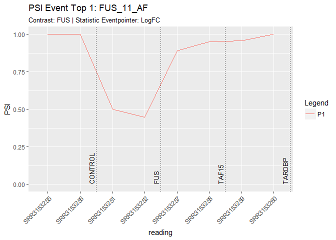
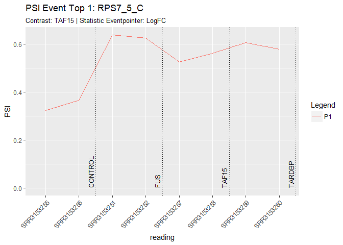
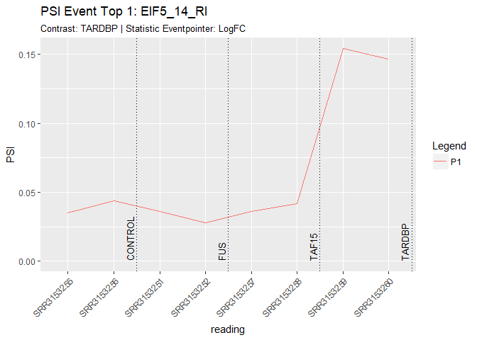
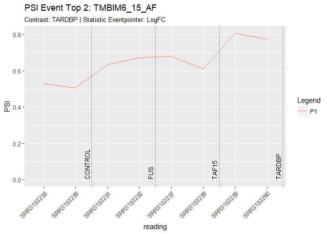

TUTORIAL. Integration of CLIP experiments of RNA-binding proteins: a novel approach to predict context-dependent splicing factors from transcriptomic data
================
Fernando Carazo, Marian Gimeno, Juan A. Ferrer-Bonsoms and Angel Rubio

*Tecnun (University of Navarra), Paseo Manuel Lardizábal 15, 20018 San Sebastián, SPAIN*

<br />

This is the tutorial for the publication: *"Integration of CLIP experiments of RNA-binding proteins: a novel approach to predict context-dependent splicing factors from transcriptomic data"*

In this tutorial, we present the methodology to predict context-specific splicing factors based on the combination of CLIP experiments with transcriptomic data (See the main manuscript for more details).

Here, we show the pipeline using a gold-standard experiment in which specific splicing factors are knocked-down.

Experiment description
----------------------

The dataset \[1\] individually depleted three RBPs implicated in amyotrophic lateral sclerosis: FUS, TAF15 and TARDBP. The experiment was performed in human iPSCs derived from dermal fibroblast cells of a healthy individual. In these experiments, we a priori know which are the splicing factors that ultimately change the splicing patterns (i.e. the depleted ones).

Transcripts and genes expression were estimated from RNA-seq data using the standard pipeline of [Kallisto](http://pachterlab.github.io/kallisto/starting.html). [GeneCode 24](https://www.gencodegenes.org/) (hg38) was chosen as the reference transcriptome. This transcriptome contains 199,169 transcripts and 58,684 genes.

*\[1\] Kapeli K, Pratt GA, Vu AQ, Hutt KR, Martinez FJ, Sundararaman B, et al. Distinct and shared functions of ALS-associated proteins TDP-43, FUS and TAF15 revealed by multisystem analyses. Nat Commun*

Library and source
------------------

``` r
library(MASS)
library(prodlim)
library(ggplot2)
library(matrixStats)
library(tidyr)
library(limma)
```

    ## Warning: package 'limma' was built under R version 3.5.1

``` r
library(qvalue)
```

    ## Warning: package 'qvalue' was built under R version 3.5.1

``` r
library(HGNChelper)
library(pheatmap)

source('./SFprediction/code/AuxFunctions.R')
source('./SFprediction/code/transfromedge.R')
source('./SFprediction/code/sacartranscritos.R')
source('./SFprediction/code/comprobaciontranscritos.R')
source('./SFprediction/code/SGSeq_Correction.R')
source('./SFprediction/code/AnnotateEvents_KLL.R')
source('./SFprediction/code/EventsGTFfromTrancriptomeGTF.R')
source("./SFprediction/code/ggmatplot.R")
source("./SFprediction/code/multiplot.R")
source('./SFprediction/code/EventP_statistic.R')
source('./SFprediction/code/GetPSI_Kallisto_2_F.R')
```

Load experiment
---------------

``` r
# Transcript expression (Using Kallisto, genecode24)
load(file = "./SFprediction/data/input/RNAseq/2018-09-18 FUS_TAF15/2018-09-20_RNAseq_FUS_TAF15.RData")

# Remove a condition not used
iFus_Taf <- which(cond == "KD-FUS&TAF15")
RNAseq <- RNAseq[, -iFus_Taf]
cond <- cond[ -iFus_Taf]
info <- info[-iFus_Taf, ]
cond <- gsub("KD-", "", cond)
cond[cond == "TDP43"] <- "TARDBP"
cond[cond == "Scramble"] <- "CONTROL"
iS <- c(3,4,1,2,5,6,7,8)
cond <- cond[iS]
RNAseq <- RNAseq[,iS]

rm(iFus_Taf, iS)

RNAseq <- as.matrix(RNAseq)
```

Gene expression
---------------

As a preliminary step, we compared gene expression changes between conditions SCR, KD-FUS, KD-TAF15 and KD-TARDBP in order to confirm the knock-down effect of the inhibitions. As expected, FUS, TAF15 and TARDBP were under-expressed in the knock-down samples.

``` r
load(file = "./SFprediction/data/input/Gencode24/TranscriptInfo/namesGenCode24.RData")

names2 <- rownames(RNAseq)

namestransG24 <- sapply(strsplit(namesGenCode24,"\\."),function(X)return(X[1]))
ENSGnames <- sapply(strsplit(namesGenCode24,"\\|"),function(X) return(X[2])) 
HUGOnames <- sapply(strsplit(namesGenCode24,"\\|"),function(X) return(X[6]))

iix <- match(names2,namestransG24)
namestransG24<-namestransG24[iix]
ENSGnames<-ENSGnames[iix]
HUGOnames<-HUGOnames[iix]

fENSGnames <- factor(HUGOnames)
fnames <- factor(names2)
library(Matrix)
```

    ## 
    ## Attaching package: 'Matrix'

    ## The following object is masked from 'package:tidyr':
    ## 
    ##     expand

``` r
GxT <- sparseMatrix(i=as.numeric(fENSGnames), j = as.numeric(fnames), x =1)
rownames(GxT) <- levels(fENSGnames)
colnames(GxT) <- levels(fnames)

#columnas de GxT tienen que ser el mismo orden que filas RNAseq
jjx <-match(names2,colnames(GxT))
GxT <- GxT[,jjx]

#comprobacion que está bien:
# n<-37
# GxT[n,which(HUGOnames==rownames(GxT)[n])]

RNAseqGenes <- GxT %*% Matrix(RNAseq)
RNAseqGenes <- as.matrix(RNAseqGenes)

# Salida <- medpolish(log2(1+RNAseqGenes))
# str(Salida)
# Salida$col

Exp <- RNAseqGenes[c("FUS", "TAF15", "TARDBP"), ]
colnames(Exp) <- cond
ggmatplot(dat = t(log2(1 + as.matrix(Exp)))) +
  ylab("log2(1 + Exp)") + xlab("Samples") + ggtitle("Expression RBPs knocked-down GSE77702")
```

    ## Loading required package: dplyr

    ## 
    ## Attaching package: 'dplyr'

    ## The following object is masked from 'package:matrixStats':
    ## 
    ##     count

    ## The following object is masked from 'package:MASS':
    ## 
    ##     select

    ## The following objects are masked from 'package:stats':
    ## 
    ##     filter, lag

    ## The following objects are masked from 'package:base':
    ## 
    ##     intersect, setdiff, setequal, union

    ## Loading required package: tibble


``` r
knitr::kable(RNAseq[1:5,1:5])
```

|                 |  SRR3153255|  SRR3153256|  SRR3153251|  SRR3153252|  SRR3153257|
|-----------------|-----------:|-----------:|-----------:|-----------:|-----------:|
| ENST00000456328 |   0.0994299|   0.0774865|     0.15482|   0.0298202|   0.1423580|
| ENST00000450305 |   0.0000000|   0.0000000|     0.00000|   0.0000000|   0.0000000|
| ENST00000488147 |   0.3770270|   0.7633900|     1.05537|   0.8655870|   1.5519700|
| ENST00000619216 |   0.0000000|   2.0906600|     1.11514|   0.5672200|   0.0000000|
| ENST00000473358 |   0.0000000|   0.0000533|     0.00000|   0.0000000|   0.0890345|

Get PSI of events
-----------------

Changes in splicing events are usually measured by the Percent Spliced-In (PSI). PSI is defined as the relative expression of one path of the event against the expression of the reference, as follows:

$$PSI=\\frac{p\_1}{(p\_1+p\_2 )}=\\frac{p\_1}{p\_r}$$

, where p1 and p2 are the expression of the two alternative paths of a splicing event and pr is the expression of the nearest common region of the alternative paths. An expression filter is set to remove lowly expressed events and events that only express one path –in which there is not alternative splicing. In this filter, the three paths are required to express at least quantile 0.1 in 75% samples.

The PSI for all the events in the transcriptome (118,830 in GenCode v24) is estimated using EventPointer\[2\].

*\[2\] Romero JP, Muniategui A, Miguel FJ De, Aramburu A, Miguel F De. EventPointer: An effective identification of alternative splicing events using junction arrays. BMC Genomics.*

``` r
# Events in genCode 24
load("./SFprediction/data/input/EventsFound_genecode24/PathEvxTranx.RData")

# Rename transcripts
PathEvxTranx$transcritnames <- sapply(strsplit(PathEvxTranx$transcritnames,"\\."),function(X) return(X[1]))


Qt <- 0.1
PSI_ii <-GetPSI_Kallisto_2_F(PathEvxTranx, RNAseq, Qn = Qt)

PSI<-PSI_ii$PSI
ExpEvs<-PSI_ii$ExpEvs

dim(PSI)
```

    ## [1] 80747     8

``` r
knitr::kable(PSI[1:5,1:5])
```

|                       |  SRR3153255|  SRR3153256|  SRR3153251|  SRR3153252|  SRR3153257|
|-----------------------|-----------:|-----------:|-----------:|-----------:|-----------:|
| ENSG00000237491.8\_4  |   0.3667884|   0.2930547|   0.4396050|   0.2287307|   0.1088034|
| ENSG00000237491.8\_5  |   0.0730756|   0.0000000|   0.1599159|   0.1324675|   0.0694370|
| ENSG00000237491.8\_6  |   0.3168681|   0.2233122|   0.3109133|   0.1109621|   0.0000000|
| ENSG00000237491.8\_7  |   1.0000000|   0.9102053|   0.9680495|   1.0000000|   0.9576961|
| ENSG00000237491.8\_16 |   0.4723803|   0.4158697|   0.3059570|   0.5621864|   0.5873502|

Statistical analysis of PSI
---------------------------

A statistical significance is assessed to each event following the standard pipeline of EventPointer using the test based on the PSI (one of the paths must decrease and the other increase).

``` r
Method_PSI_stat <- "Eventpointer" 

# only if Method_PSI_stat == Eventpointer
EP_method <- "LogFC" # "LogFC"  "Dif_LogFC" "DRS"
#---

if(Method_PSI_stat == "Eventpointer"){
  
  RBP <- as.character(unique(cond)); RBP <- RBP[-which(RBP=="CONTROL")]
  
  cond <- as.factor(cond)
  cond <-relevel(cond,"CONTROL")
  
  Dmatrix <- model.matrix(~cond)
  colnames(Dmatrix) <- gsub("cond","",colnames(Dmatrix))
  
  Cmatrix <- diag(length(colnames(Dmatrix)[-1]))
  Cmatrix <- rbind(0,Cmatrix)
  colnames(Cmatrix) <- colnames(Dmatrix)[-1]
  rownames(Cmatrix) <- colnames(Dmatrix)
  
  P_values_EP <- EventP_statistic(ExpEvs, Statistic = EP_method, Dmatrix, Cmatrix)
  
  mynames <- P_values_EP[[1]][,1]
  for (jj in 2:length(P_values_EP)){
    P_values_EP[[jj]] <- P_values_EP[[jj]][match(mynames,P_values_EP[[jj]][,1]),]
  }
  P_value_PSI <- sapply(P_values_EP,function(X)return(X[,2]))
  rownames(P_value_PSI)<-mynames
  
}
```

    ## Done
    ##  Analysis Finished
    ##  Done 
    ## 
    ##  5:40:52 PM  Analysis Completed

``` r
rownames(Dmatrix) <- colnames(PSI)

dim(P_value_PSI)
```

    ## [1] 80747     3

``` r
head(P_value_PSI)
```

    ##                                FUS        TAF15       TARDBP
    ## ENSG00000170142.11_9  8.421141e-05 6.486432e-04 1.573613e-05
    ## ENSG00000124795.14_22 3.953003e-04 4.787659e-04 3.569035e-01
    ## ENSG00000176871.8_20  9.999871e-01 3.336878e-02 9.660210e-01
    ## ENSG00000075415.12_20 9.947462e-01 5.458058e-05 9.999982e-01
    ## ENSG00000158373.8_1   9.642958e-01 9.757247e-01 1.471976e-03
    ## ENSG00000146731.10_13 9.995737e-01 4.223365e-01 4.862333e-02

``` r
for(h in 1:ncol(Cmatrix)){
  hist(P_value_PSI[,h], 1000, main = paste0(colnames(Cmatrix)[h], ": Histogram of Splicing P-values"))
  print(pi0est(P_value_PSI[,h])$pi0)
  plot(qvalue(P_value_PSI[,h]))
}
```


    ## [1] 1


    ## [1] 1


    ## [1] 1


``` r
apply(P_value_PSI, 2, FUN = function(x) sum(x < 1e-3))
```

    ##    FUS  TAF15 TARDBP 
    ##   1004    945   1791

Load ExS (Events x Splicing factors) matrix
-------------------------------------------

For each RBP, we summarized its CLIP experiments into a single dataset following an inclusive criterion: if a binding site is annotated to any CLIP experiment, it is considered as a putative regulation. As a result of this mapping, we got a binary matrix (named ExS, Events x Splicing factors) relating splicing events with RBPs.

``` r
load(file = "./SFprediction/data/input/2018-11-16_ExS_COMB_peaks_within_POSTAR.RData")

knitr::kable(ExS[1:5,1:5])
```

|                      |  AARS|  AGGF1|  AKAP8L|  ALKBH1|  ALKBH5|
|----------------------|-----:|------:|-------:|-------:|-------:|
| ENSG00000223972.5\_2 |     0|      0|       0|       0|       0|
| ENSG00000223972.5\_3 |     0|      0|       0|       0|       0|
| ENSG00000223972.5\_4 |     0|      0|       0|       0|       0|
| ENSG00000243485.3\_1 |     0|      0|       0|       0|       0|
| ENSG00000236601.2\_3 |     0|      0|       0|       0|       0|

CLIP enrichment analysis
------------------------

Finally, we compared the RBPs that bind against differentially spliced with non-differentially spliced events using a Fisher’s exact test. We ranked the RBPs according to the resulting p-value. (See Methods section for more details).

``` r
# Initialize variables
ExS <- ExS[rownames(P_value_PSI), ]
TableF <- data.frame(Cond = RBP, Pv_diff = NA, Rnk = NA, Pv_hyp = NA, RBP_min = NA, Pv_min = NA, PV_diff_minRBP=NA)
myHypers <- vector(mode="list",length = ncol(Cmatrix))
names(myHypers) <- colnames(Cmatrix)
myExpr<-vector(mode="list",length = ncol(Cmatrix))
names(myExpr) <- colnames(Cmatrix)
myComb<-vector(mode="list",length = ncol(Cmatrix))
names(myComb) <- colnames(Cmatrix)

for(cSel in 1:ncol(Cmatrix)){
  colnames(Cmatrix)[cSel]
  
  hyperM <- data.frame(RBP = colnames(ExS),
                       nHits = colSums(ExS),
                       Pvalue_hyp_PSI =NA,
                       N = NA,
                       d = NA,
                       n = NA,
                       x = NA,
                       qhyp_0.5 = NA,
                       Fc = NA,
                       stringsAsFactors = F)
  nSel <- 1000
  nmTopEv <- (rownames(P_value_PSI)[order(P_value_PSI[,cSel])])[1:nSel]
  
  for(i in 1:ncol(ExS)){
    hits <- ExS[,i]
    N <- nrow(ExS)
    d <- sum(hits)
    n <- length(nmTopEv)
    hits2 <- hits==1
    
    x <- sum(rownames(ExS)[hits2] %in% nmTopEv)
    hyperM[i, "Pvalue_hyp_PSI"] <- phyper(x, d, N-d, n, lower.tail = F)
    qhyp <- qhyper(0.5, d, N-d, n, lower.tail = F)
    hyperM[i,4:9] <- c(N, d, n, x, qhyp, x/qhyp)
  }
  
  aux <- hyperM[, c("RBP", "Pvalue_hyp_PSI")]
  if(colnames(Cmatrix)[cSel]%in%hyperM$RBP){
    aux$Cond <- hyperM$RBP[which(hyperM$RBP == colnames(Cmatrix)[cSel])]
  }else{
    aux$Cond<-colnames(Cmatrix)[cSel]
  }
  
  
  hyperM <- hyperM[order(hyperM$Pvalue_hyp_PSI), ]
  myHypers[[cSel]]<-hyperM
  
  
  ##Limma with expression
  cond <- as.factor(cond)
  cond <-relevel(cond,"CONTROL")
  Dmatrix <- model.matrix(~cond)
  colnames(Dmatrix) <- gsub("cond","",colnames(Dmatrix))
  
  Fit<-lmFit(log2(RNAseqGenes+1), design = Dmatrix)
  
  Cmatrix <- diag(length(colnames(Dmatrix)[-1]))
  Cmatrix <- rbind(0,Cmatrix)
  colnames(Cmatrix) <- colnames(Dmatrix)[-1]
  rownames(Cmatrix) <- colnames(Dmatrix)
  
  FitA<-contrasts.fit(Fit,Cmatrix)
  FitA <- eBayes(FitA)
  B <- toptable(FitA,coef=cSel, num=Inf, sort.by = "none")
  
  myExpr[[cSel]]<-B
  
  mrg <- merge(hyperM, B, by.x = "RBP", by.y = "row.names", all.x = T)
  mrg <- mrg[order(mrg$Pvalue_hyp_PSI), ]
  rownames(mrg) <- NULL
  myComb[[cSel]] <- mrg
  
  if (colnames(Cmatrix)[cSel]%in%hyperM$RBP){
    
    TableF$Rnk[cSel]<-which(hyperM$RBP == colnames(Cmatrix)[cSel])
    TableF$Pv_hyp[cSel]<-hyperM$Pvalue_hyp_PSI[which(hyperM$RBP == colnames(Cmatrix)[cSel])]
    TableF$RBP_min[cSel]<-hyperM$RBP[1]
    TableF$Pv_min[cSel]<-hyperM$Pvalue_hyp_PSI[1]
  }else {
    TableF$Rnk[cSel]<-NA
    TableF$Pv_hyp[cSel]<-NA
    TableF$RBP_min[cSel]<-hyperM$RBP[1]
    TableF$Pv_min[cSel]<-hyperM$Pvalue_hyp_PSI[1]
  }
  
}
```

    ## Warning: Zero sample variances detected, have been offset away from zero

    ## toptable() is deprecated and will be removed in the future version of limma. Please use topTable() instead.

    ## Warning: Zero sample variances detected, have been offset away from zero

    ## toptable() is deprecated and will be removed in the future version of limma. Please use topTable() instead.

    ## Warning: Zero sample variances detected, have been offset away from zero

    ## toptable() is deprecated and will be removed in the future version of limma. Please use topTable() instead.

``` r
# Summary table
TableF
```

    ##     Cond Pv_diff Rnk       Pv_hyp RBP_min       Pv_min PV_diff_minRBP
    ## 1    FUS      NA  11 2.351724e-09   CPSF7 3.666269e-13             NA
    ## 2  TAF15      NA 195 9.998287e-01    SBDS 2.730710e-05             NA
    ## 3 TARDBP      NA  20 2.096521e-05   DDX3X 3.403654e-11             NA

We also imposed the candidate RBPs to be differentially expressed in the conditions under study.

``` r
myComb$FUS[which((myComb$FUS$Pvalue_hyp_PSI < 0.05) & (myComb$FUS$P.Value < 0.05) & (abs(myComb$FUS$logFC) > 0.58)),]
```

    ##        RBP nHits Pvalue_hyp_PSI     N     d    n   x qhyp_0.5       Fc
    ## 11     FUS 30302   2.351724e-09 80747 30302 1000 465      375 1.240000
    ## 25  LIN28A 13204   1.780916e-06 80747 13204 1000 219      163 1.343558
    ## 56     FBL  3944   3.115677e-04 80747  3944 1000  73       49 1.489796
    ## 64    YBX3 11706   4.939795e-04 80747 11706 1000 182      145 1.255172
    ## 109  CPSF2  3238   2.576721e-02 80747  3238 1000  52       40 1.300000
    ##          logFC         t      P.Value  adj.P.Val          B
    ## 11  -1.0909153 -8.003647 0.0007542806 0.09772049 -0.1107771
    ## 25   0.6877531  6.411275 0.0019301613 0.14278091 -1.2037169
    ## 56  -0.8101063 -3.940125 0.0131808544 0.30952592 -3.4419085
    ## 64  -0.7924512 -5.127866 0.0048002192 0.20804731 -2.2676275
    ## 109 -0.6996895 -7.905829 0.0007951722 0.09907406 -0.1719255

``` r
myComb$TARDBP[which((myComb$TARDBP$Pvalue_hyp_PSI < 0.05) &(myComb$TARDBP$P.Value < 0.05) & (abs(myComb$TARDBP$logFC) > 0.58)),]
```

    ##       RBP nHits Pvalue_hyp_PSI     N     d    n   x qhyp_0.5       Fc
    ## 20 TARDBP 55546   2.096521e-05 80747 55546 1000 746      688 1.084302
    ## 26  RBM22 12925   6.690297e-05 80747 12925 1000 205      160 1.281250
    ## 58  PTBP2 11650   3.735276e-03 80747 11650 1000 174      144 1.208333
    ## 68  SF3A3 18044   7.859515e-03 80747 18044 1000 255      223 1.143498
    ## 81    FBL  3944   1.813049e-02 80747  3944 1000  63       49 1.285714
    ## 83 DICER1  2970   1.918003e-02 80747  2970 1000  49       37 1.324324
    ##         logFC          t      P.Value  adj.P.Val           B
    ## 20 -0.8696495 -13.580366 7.400185e-05 0.02155854  2.57318370
    ## 26  0.6364273  14.213118 6.038889e-05 0.01926012  2.76146584
    ## 58 -0.6017466  -7.722891 8.790690e-04 0.04565248  0.03254331
    ## 68  0.6378706   5.417548 3.851615e-03 0.07825153 -1.61674187
    ## 81  0.8908379   4.332781 9.245529e-03 0.11413933 -2.61055991
    ## 83  0.6841722  15.976863 3.577052e-05 0.01692869  3.22751751

``` r
myComb$TAF15[which((myComb$TAF15$Pvalue_hyp_PSI < 0.05) &(myComb$TAF15$P.Value < 0.05) & (abs(myComb$TAF15$logFC) > 0.58)),]
```

    ##  [1] RBP            nHits          Pvalue_hyp_PSI N             
    ##  [5] d              n              x              qhyp_0.5      
    ##  [9] Fc             logFC          t              P.Value       
    ## [13] adj.P.Val      B             
    ## <0 rows> (or 0-length row.names)

Plot events
-----------

``` r
# Load event info

load("./SFprediction/data/input/EventsFound_genecode24/good_classification/EventsFound_gencode_v24_goodClass_mod.RData")
EventsFound$EventID <- paste(EventsFound$EventID, EventsFound$EventNumber, sep = "_")
pos <- cumsum(table(as.character(cond))[as.character(unique(cond))]) + .5
df <- data.frame(Cond = as.character(unique(cond)), Pos = pos)

##
```

### Top 2 Events by condition

``` r
for(c in 1:ncol(Cmatrix)){
  cn <- colnames(Cmatrix)[c]
  ord <- order(P_value_PSI[, c])
  
  for(ev in 1:2){
    evN <- rownames(P_value_PSI)[ord[ev]]
    iEv <- which(names(ExpEvs) == evN)
    
    evName <- EventsFound$EventID2[which(EventsFound$EventID == evN)]
    
    P1 <- (ggmatplot(log2(1+ExpEvs[[iEv]][,c(1,2)])) +
             geom_vline(xintercept = pos, linetype="dotted") +
             ylab("log2 (1 + TPM)") +
             ggtitle(label = sprintf("EXPRESSION Event Top %s: %s",ev, evName), subtitle = sprintf("Contrast: %s | Statistic %s: %s", colnames(Cmatrix)[c], Method_PSI_stat, EP_method)) +
             geom_text(data = df, mapping = aes(x = Pos, y = 0, label = Cond), col = "black", size=3.3, angle=90, vjust=-0.4, hjust=0, inherit.aes = FALSE))
    # dev.off()
    
    P2 <- (ggmatplot(ExpEvs[[iEv]][, c(1), drop = F] / ExpEvs[[iEv]][, c(3)]) +
             geom_vline(xintercept = pos, linetype="dotted") +
             ylab("PSI") +
             ggtitle(label = sprintf("PSI Event Top %s: %s",iEv, evName), subtitle = sprintf("Contrast: %s | Statistic %s: %s", colnames(Cmatrix)[c], Method_PSI_stat, EP_method)) +
             geom_text(data = df, mapping = aes(x = Pos, y = 0, label = Cond), col = "black", size=3.3, angle=90, vjust=-0.4, hjust=0, inherit.aes = FALSE))
    
    print(P1)
    print(P2)

  }
}
```


